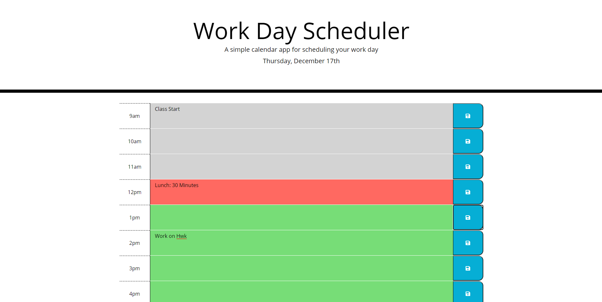

# Daily Planner

## Repository

This repository hosts all files to run a daily planner page.  It includes the HTML, CSS, and JavaScript files used on the page.

## Table of Contents
* [Daily Planner](#daily_planner)
* [Installation](#installation)
* [Usage](#usage)
* [Development Roadmap](#development_roadmap)
* [Contributing to the Daily Planner](#contributing)
* [License](#license)

## Daily Planner

Site link: [https://udunomancer.github.io/gt-ft-daily-planner/](https://udunomancer.github.io/gt-ft-daily-planner/)

This Planner contains one page, where a user can generate a random password by clicking a button and responding to prompts.

## Installation

If you'd like to use this page as a template, feel free to fork the repository at [https://github.com/Udunomancer/gt-ft-daily-planner](https://github.com/Udunomancer/gt-ft-daily-planner)

## Usage

* The page should load with the current date in the header
* Each hour block should be color coded depending on if the hour has passed, the hour is current, or the hour is in the future
* The user should be able to interact with each time block, enter notes, and save them to local storage
* Page content should update on hour and day changes
* Previously saved agenda items should be loaded into/from Local Storage

## Development Roadmap

**Initial Repository/Site Build (12/17/2020)**
* Added html and css files to repository
* Built working JavaScript to load page and save agenda items

**Future Roadmap**
* Add functionality for user customization (time blocks to display, etc)
* Add functionality for recurring events
* Add functionality for using planner for different dates

## Contributing to the Daily Planner

No direct contributions to repository accepted at this time

## License

[License](Assets/license.txt)
